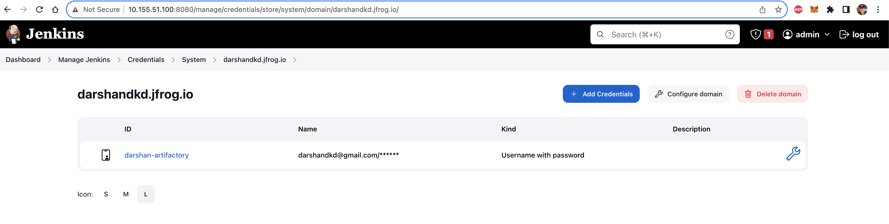
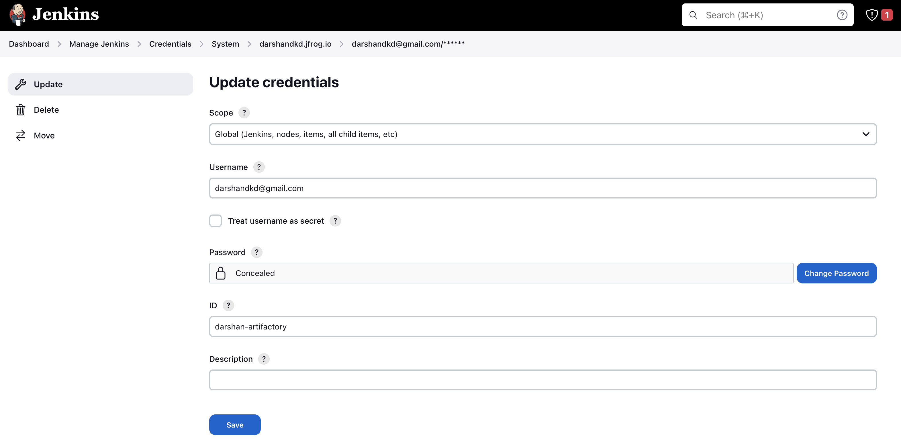
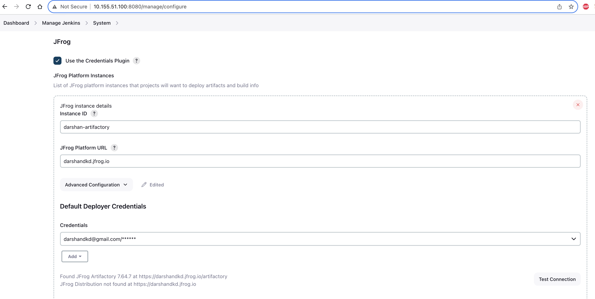
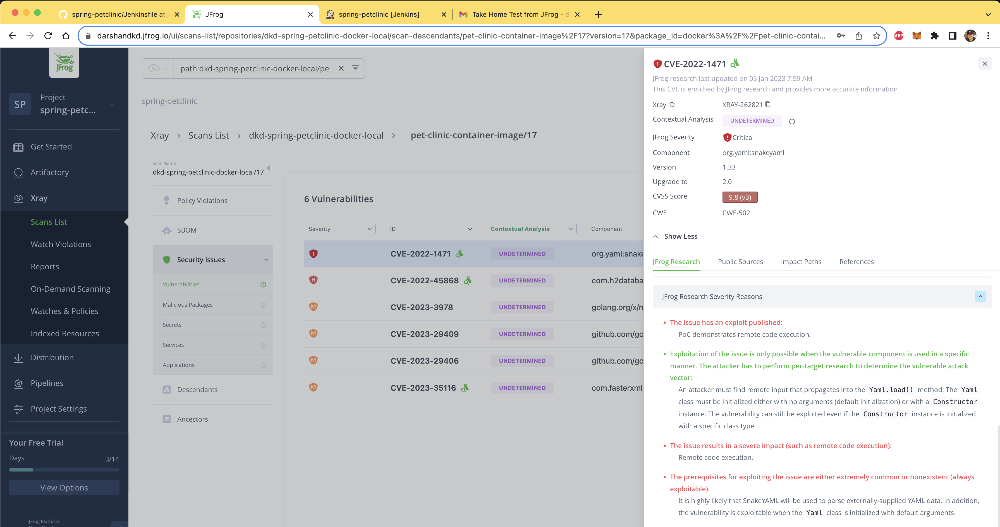
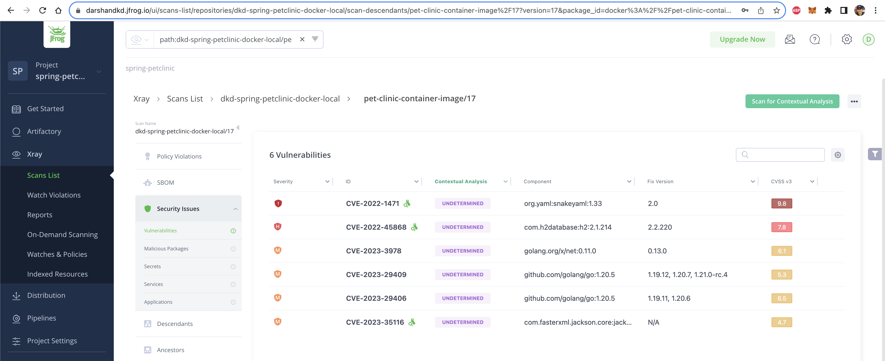

# jFrog Tech-assessment:

1. Installed Jenkins 2.414.1 on Ubuntu 22.04
2. Signed up for a 14 days trial account with jFrog and set up an Artifactory (type - Pre-built setup)
3. Set up Jenkins to connect with jFrog to upload Dockerfile on Artifactory, jFrog plugin installation

    
    
    
    
    
4. Forked "spring-petclinic" source repo to my GitHub repo [https://github.com/darshandkd/spring-petclinic/](https://github.com/darshandkd/spring-petclinic/)
5. Configured a Jenkinsfile with required build stages with tests, and uploaded the runnable Docker image to jFrog Artifactory
6. Enabled X-ray on jFrog to scan potential security risks identified in uploaded Docker image, in Artifactory repository.

7. At the end of the Jenkins pipeline execution, we can see that the Docker image is being uploaded to jFrog Artifactory, and X-ray is scanning the uploaded image.

    
    
8. Created a Dockerfile for the "spring-petclinic" Java application as mentioned in the deliverables.
9. To pull jFrog Docker image:
   
   9.1 - Login to jFrog using Docker client:
   ```bash
   docker login darshandkd.jfrog.io
   ```
   9.2 - Fetch the Docker image using the pull command below:

   ```bash
   docker pull darshandkd.jfrog.io/dkd-spring-petclinic-docker/pet-clinic-container-image:26
   ```
   - Note: 26 indicates the Jenkins build number.

## Challenges explored:
1. Jenkins user got to be added under authorized user on Ubuntu:
    ```bash
    usermod -aG root jenkins
    ```
2. Setting up credentials of jFrog in Jenkinsfile without using hard-coded credentials or environment variable, used jFrog Credential ID.

3. Navigating through jFrog UI and understanding features and artifactory repository.
